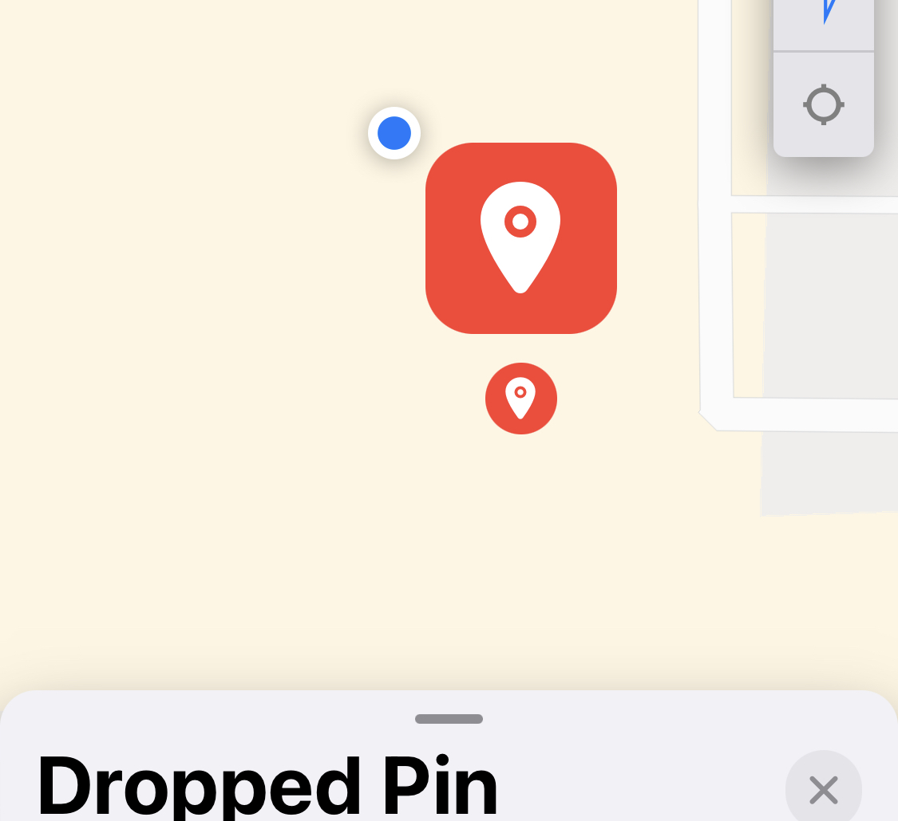
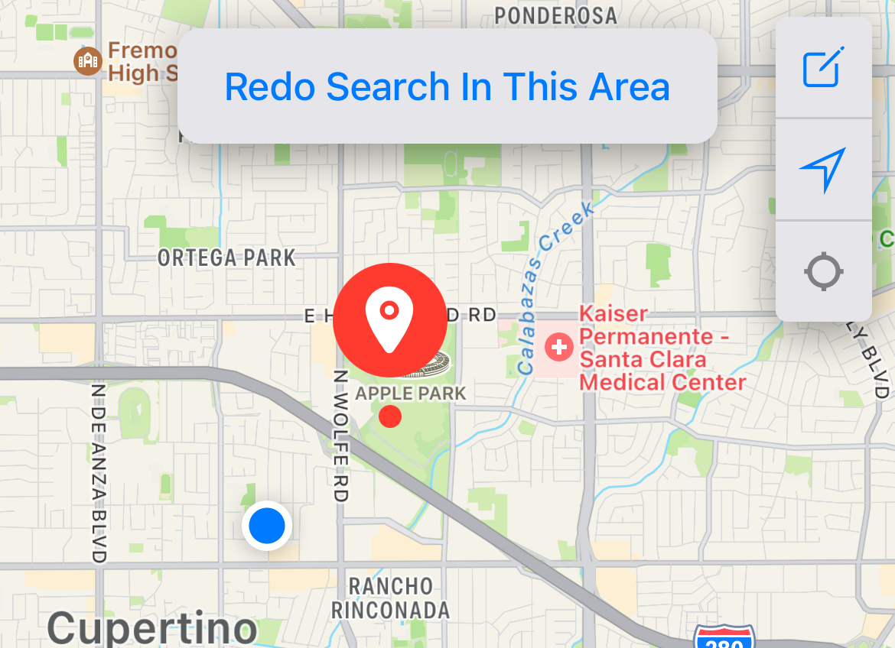
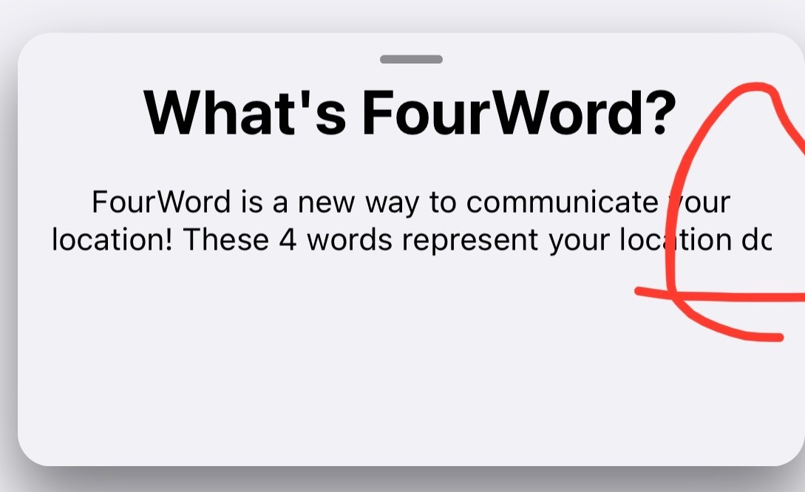
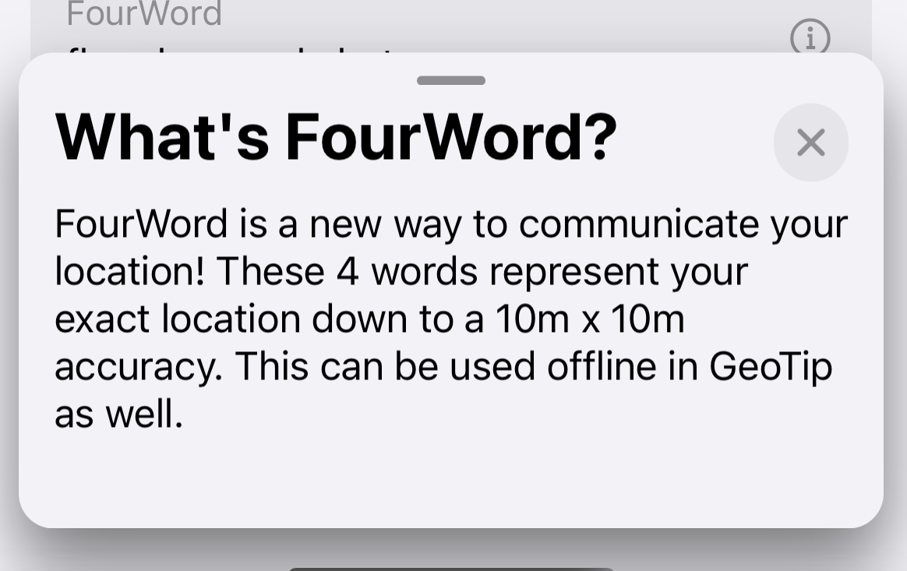
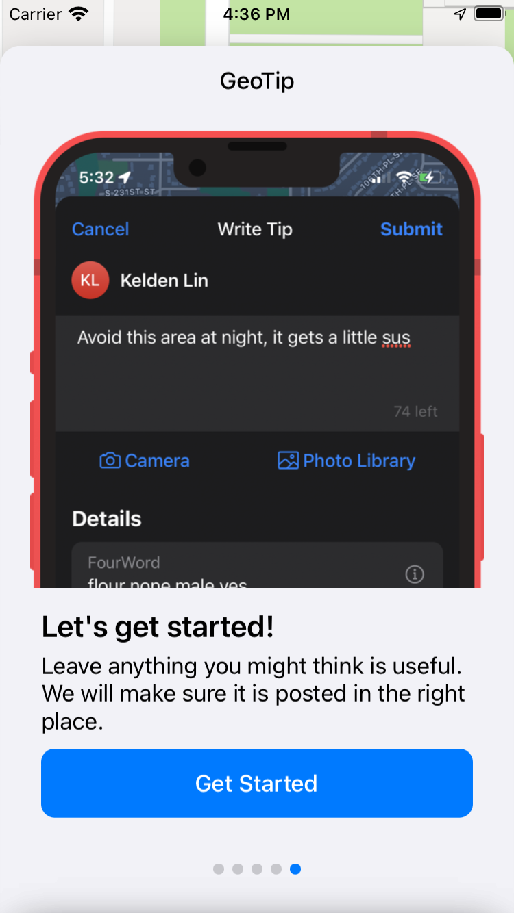

# Changelog
Follow along to see what changes were introduced in each GeoTip version that is released!

### `Latest`
### `Beta Releases`
# **Version 0**
Version 0 will represent the pre-release closed and open beta testing versions.

## Version 0.3
Smaller bug fixes and improvements as GeoTip preps for public beta launch
#### What's New
- Update app initial zoom level and user location "focus" to be further away
- Make "What's FourWord?" link under the search bar more clickable
- Update [GeoTip landing website](/) to have better introduction content

#### Bug Fixes
- Closing a single tip page now properly deselects the tip pin on the map
- Updating your Profile Icon now automatically updates the posts you're viewing with your new Profile Icon

#### Known  Issues
- Searching for a location and tapping on it sometimes doesn't take you to the pin properly

#### Coming Soon
- Exploring how to more easily create tips at existing landmarks (like restaurants) – Thanks @allison!
- New page that shows all the tips you've posted – Thanks @kevin!
- Options to sort tips (New vs. Best)
- Make a more obvious "Create Tip" button – Thanks @alex!
- Add a graphic for when there are no recent searches – Thanks @alex!
- Filtering through tips at a location (keyword search) – Thanks @alex!

 

## Version 0.2
Big improvements around pins on the map, as well as various (quite big) reported bug fixes.
#### What's New
- Improve map "pin" (for location and tips) design to be less repetitive (smaller circle when viewing pin)
    - Before (left) and After (right) 
    - {:.changelogImg} 

- Combined "user search pins" with "dropped pins" to avoid confusing multiple pin situation 
    - Before (left) and After (right) 
    - {:.changelogImg} 
- Added a close button and improved design for "What's Fourword" popup
    - Before (left) and After (right) 
    - {:.changelogImg} 
- Update Search wording to make it more obvious that you can search locations by keyword
    - "Address" -> "By Place"
- Update create icons everywhere to have a "+" icon for a more clear action
- Renamed Dropped Pin sheet's "Move Here" button to "View Pin" for a more clear action
- Reduce title sizes to be a little smaller

#### Bug Fixes
- Fixed a bug where the tips list would never load on the first launch of the app (so you had to click on "Redo Search" to get past the loading) – Thanks @kevin!
- Fix Tutorial/Onboarding experience on smaller iPhone screen sizes (iPhone SE) – Thanks @eliza!
    - It was clipping off the "Get started!" button, so you literally couldn't get started (lol)
    - Before (left) and After (right) 
    - {:.changelogImg} 
- Fixed a bug where the profile icon initials & colors for tip didn't actually reflect the creator (it actually used your own if you're logged in)
- Long pressing to create a pin now does not vibrate twice
- Fixed the "Leave a review" link to properly link to the (future) app store page

#### Known  Issues
- Searching for a location and tapping on it sometimes doesn't take you to the pin properly

#### Coming Soon
- Exploring how to more easily create tips at existing landmarks (like restaurants) – Thanks @allison!
- New page that shows all the tips you've posted – Thanks @kevin!
- Options to sort tips (New vs. Best)
- Make a more obvious "Create Tip" button – Thanks @alex!
- Add a graphic for when there are no recent searches – Thanks @alex!
- Filtering through tips at a location (keyword search) – Thanks @alex!
- Make "What's FourWord" link under the search bar more clickable – Thanks @alex!

 

## **Version 0.1**
This is the first beta test version to the app! Thank you everybody who signed up to test it on TestFlight :)

#### What's New
- Everything
- [Created a privacy policy](/privacypolicy)

#### Bug Fixes
- None (cuz first version)

 

 