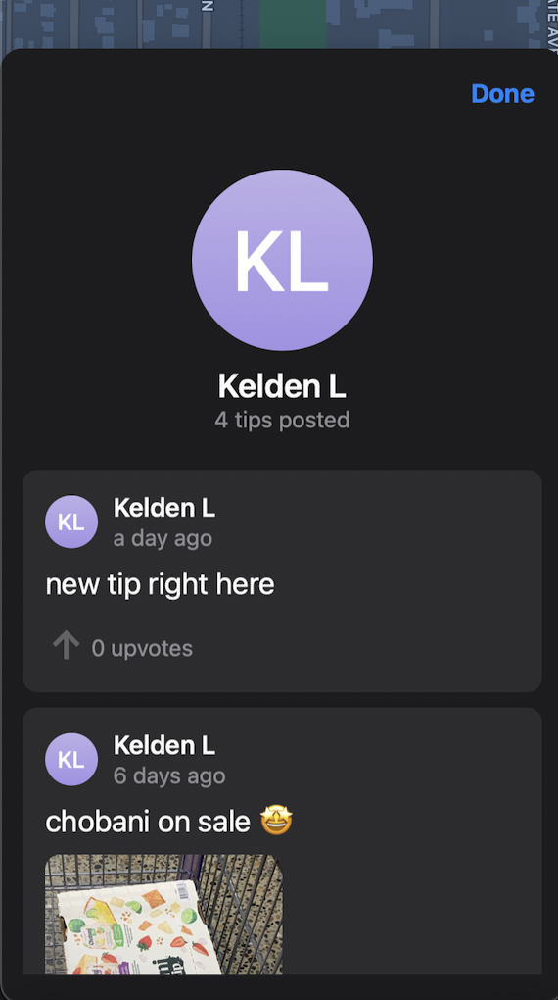

# Changelog
Follow along to see what changes were introduced in each GeoTip version that is released!

### `Latest`
### `Beta Releases`
# **Version 0**
Version 0 will represent the pre-release closed and open beta testing versions.

## Version 0.6 (4/19/2022)
Continued [public beta testing](https://testflight.apple.com/join/kCeS9Hut).   
This release bundles a ton of QoL (quality of life) improvements, some design tweaks and sorting.
#### What's New
- Tips view can now be sorted by NEW or BEST
- You can now upvote the tip you're viewing
- Action button (View on Map and Upvote) now moved higher up for easier access when viewing a tip
- Removed upvoting tips on user profile
- Upvotes throughout the map is now red (matching the red icon theme)
- Errors now alert me (Kelden), so turnaround time for errors should be faster

#### Bug Fixes
- Fixed a bug where tips won't load at your location when you first open the app
- Fixed a bug where deleting a tip doesn't dismiss the tip view you were on previously, showing an infinite loading spinner
- Fixed "no tips" text for user profiles when they have no tips
- QoL: When creating a new tip, it shows on the top (instead of the bottom)
- QoL: Creating a tip after viewing a dropped pin now takes you back to your tips list (instead of going back to the dropped pin)
- QoL: Pressing "View on Map" on a tip now automatically scroll the tip sheet to the top (it looked weird / cut off before)
- QoL: Report sheet goes away after successfully reporting a tip

#### Known Issues
_None_
#### Coming Soon
- Options to select how you want to display your name
- Filtering through tips at a location (keyword search) – Thanks @alex!
- Add a graphic for when there are no recent searches – Thanks @alex!
- Exploring how to more easily create tips at existing landmarks (like restaurants) – Thanks @allison!

## Version 0.5 (4/11/2022)
OFFICALLY first public beta version!!!! [DOWNLOAD IT HERE](https://testflight.apple.com/join/kCeS9Hut).   This release stabilizes the app as well as improves security throughout the app.
#### What's New
- OPEN FOR LIMITED PUBLIC BETA TESTING!! [Click here to get started!!](https://testflight.apple.com/join/kCeS9Hut)
- [No visual difference] All backend requests are much more secure, and now protected on multiple levels of authentication (in the code)
- Updated landing page tagline, attached a video instead of just a screenshot on the demo iPhone

#### Bug Fixes
- Fixed a bug where editing posts no longer remove your user profile weirdly

#### Known Issues
- Searching for a location and tapping on it sometimes doesn't take you to the pin properly

#### Coming Soon
- Options to select how you want to display your name
- Options to sort tips (New vs. Best)
- Filtering through tips at a location (keyword search) – Thanks @alex!
- Make a more obvious "Create Tip" button – Thanks @alex!
- Add a graphic for when there are no recent searches – Thanks @alex!
- Exploring how to more easily create tips at existing landmarks (like restaurants) – Thanks @allison!

 

## Version 0.4 (4/9/2022)
Introducing USER PROFILES!!! Final testing & some small QoL improvements before public beta. Added dates to these release changelogs.
#### What's New
- New page that shows all the tips you've posted – Thanks @kevin!
    - {:.changelogImg} 
- Added new "View on map" option when viewing a tip
- App now only shows last initial (as opposed to user full name) for privacy purposes (settings for this coming soon)

#### Bug Fixes
- Fixed a bug where creating a tip from a dropped pin without logging in works – it shouldn't

#### Known Issues
- Searching for a location and tapping on it sometimes doesn't take you to the pin properly

#### Coming Soon
- Options to select how you want to display your name
- Options to sort tips (New vs. Best)
- Filtering through tips at a location (keyword search) – Thanks @alex!
- Make a more obvious "Create Tip" button – Thanks @alex!
- Add a graphic for when there are no recent searches – Thanks @alex!
- Exploring how to more easily create tips at existing landmarks (like restaurants) – Thanks @allison!

 

## Version 0.3 (4/8/2022)
Smaller bug fixes and improvements as GeoTip preps for public beta launch
#### What's New
- Update app initial zoom level and user location "focus" to be further away
- Make "What's FourWord?" link under the search bar more clickable
- Update [GeoTip landing website](/) to have better introduction content

#### Bug Fixes
- Closing a single tip page now properly deselects the tip pin on the map
- Updating your Profile Icon now automatically updates the posts you're viewing with your new Profile Icon

#### Known Issues
- Searching for a location and tapping on it sometimes doesn't take you to the pin properly

#### Coming Soon
- Exploring how to more easily create tips at existing landmarks (like restaurants) – Thanks @allison!
- New page that shows all the tips you've posted – Thanks @kevin!
- Options to sort tips (New vs. Best)
- Make a more obvious "Create Tip" button – Thanks @alex!
- Add a graphic for when there are no recent searches – Thanks @alex!
- Filtering through tips at a location (keyword search) – Thanks @alex!

 

## Version 0.2 (3/27/2022)
Big improvements around pins on the map, as well as various (quite big) reported bug fixes.
#### What's New
- Improve map "pin" (for location and tips) design to be less repetitive (smaller circle when viewing pin)
    - Before (left) and After (right) 
    - {:.changelogImg} 

- Combined "user search pins" with "dropped pins" to avoid confusing multiple pin situation 
    - Before (left) and After (right) 
    - {:.changelogImg} 
- Added a close button and improved design for "What's Fourword" popup
    - Before (left) and After (right) 
    - {:.changelogImg} 
- Update Search wording to make it more obvious that you can search locations by keyword
    - "Address" -> "By Place"
- Update create icons everywhere to have a "+" icon for a more clear action
- Renamed Dropped Pin sheet's "Move Here" button to "View Pin" for a more clear action
- Reduce title sizes to be a little smaller

#### Bug Fixes
- Fixed a bug where the tips list would never load on the first launch of the app (so you had to click on "Redo Search" to get past the loading) – Thanks @kevin!
- Fix Tutorial/Onboarding experience on smaller iPhone screen sizes (iPhone SE) – Thanks @eliza!
    - It was clipping off the "Get started!" button, so you literally couldn't get started (lol)
    - Before (left) and After (right) 
    - {:.changelogImg} 
- Fixed a bug where the profile icon initials & colors for tip didn't actually reflect the creator (it actually used your own if you're logged in)
- Long pressing to create a pin now does not vibrate twice
- Fixed the "Leave a review" link to properly link to the (future) app store page

#### Known Issues
- Searching for a location and tapping on it sometimes doesn't take you to the pin properly

#### Coming Soon
- Exploring how to more easily create tips at existing landmarks (like restaurants) – Thanks @allison!
- New page that shows all the tips you've posted – Thanks @kevin!
- Options to sort tips (New vs. Best)
- Make a more obvious "Create Tip" button – Thanks @alex!
- Add a graphic for when there are no recent searches – Thanks @alex!
- Filtering through tips at a location (keyword search) – Thanks @alex!
- Make "What's FourWord" link under the search bar more clickable – Thanks @alex!

 

## **Version 0.1 (3/22/2022)**
This is the first beta test version to the app! Thank you everybody who signed up to test it on TestFlight :)

#### What's New
- Everything
- [Created a privacy policy](/privacypolicy)

#### Bug Fixes
- None (cuz first version)

 

 